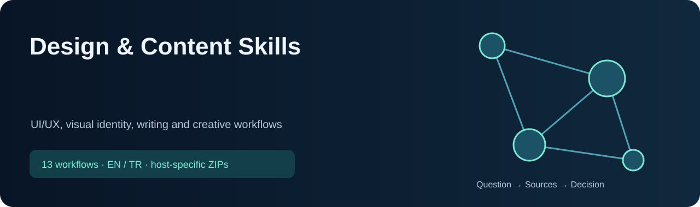

<!-- CURRENT-SKILL-PUBLICATION -->

# Design & Content Skills

13 skill: kaynak araştırma, araç seçimi ve doğrulanabilir sonuç üretme için hazır iş akışları. Modelin ağırlıklarını değiştirmez; sonuç kalitesi kullanılan kaynaklara ve araçlara bağlıdır.

 

**ChatGPT:** bütün listelenen skilleri içeren eklenti paketini indir; hesabının desteklediği kişisel eklenti/skill içe aktarma akışını kullan. Tek-skill ChatGPT bağlantısı, tek skill içeren eklenti ZIP’idir. **Claude:** toplu ZIP’i aç, içindeki tekil skill ZIP’lerini ayrı ayrı yükle. Dış ZIP tek bir Claude skill’i değildir. Yerel kurulum bulut hesabına yükleme yapmaz.

Türkçe veya İngilizce doğal isteklerle kullan; aşağıdaki örnekleri kendi soruna uyarla. Kısa kelimeler seçim ipuçlarıdır; bütün platformlarda aynı slash menüsünü oluşturmaz. Mevcut iş akışları ve güvenlik kuralları korunmuştur.

## Skill listesi

| Skill | Çözdüğü sorun / örnek istek | ChatGPT | Claude |
|---|---|---|---|
| [`web-ui-design`](skills/common/web-ui-design/SKILL.md) | Arayüz tasarla veya kullanılabilirliği iyileştir | [↓ ZIP](packages/chatgpt/web-ui-design.zip) | [↓ ZIP](packages/claude/web-ui-design.zip) |
| [`ui-ux-pro-max`](skills/common/ui-ux-pro-max/SKILL.md) | UI/UX stilini, renkleri ve yazı tiplerini seç | [↓ ZIP](packages/chatgpt/ui-ux-pro-max.zip) | [↓ ZIP](packages/claude/ui-ux-pro-max.zip) |
| [`ui-styling`](skills/common/ui-styling/SKILL.md) | Tailwind/shadcn ile arayüzü düzenle | [↓ ZIP](packages/chatgpt/ui-styling.zip) | [↓ ZIP](packages/claude/ui-styling.zip) |
| [`web-animation`](skills/common/web-animation/SKILL.md) | Web animasyonu veya sayfa geçişi oluştur | [↓ ZIP](packages/chatgpt/web-animation.zip) | [↓ ZIP](packages/claude/web-animation.zip) |
| [`design`](skills/common/design/SKILL.md) | Logo, ikon veya görsel tasarla | [↓ ZIP](packages/chatgpt/design.zip) | [↓ ZIP](packages/claude/design.zip) |
| [`design-system`](skills/common/design-system/SKILL.md) | Tasarım tokenları ve bileşen sistemi oluştur | [↓ ZIP](packages/chatgpt/design-system.zip) | [↓ ZIP](packages/claude/design-system.zip) |
| [`brand`](skills/common/brand/SKILL.md) | Marka kimliği ve iletişim dili oluştur | [↓ ZIP](packages/chatgpt/brand.zip) | [↓ ZIP](packages/claude/brand.zip) |
| [`banner-design`](skills/common/banner-design/SKILL.md) | Banner veya kapak tasarla | [↓ ZIP](packages/chatgpt/banner-design.zip) | [↓ ZIP](packages/claude/banner-design.zip) |
| [`slides`](skills/common/slides/SKILL.md) | Sunum veya HTML slayt hazırla | [↓ ZIP](packages/chatgpt/slides.zip) | [↓ ZIP](packages/claude/slides.zip) |
| [`campaign-plan`](skills/common/campaign-plan/SKILL.md) | Hedef kitle, içerik, bütçe ve ölçüm planla | [↓ ZIP](packages/chatgpt/campaign-plan.zip) | [↓ ZIP](packages/claude/campaign-plan.zip) |
| [`site-seo-audit`](skills/common/site-seo-audit/SKILL.md) | SEO denetle; teknik sorunları önceliklendir | [↓ ZIP](packages/chatgpt/site-seo-audit.zip) | [↓ ZIP](packages/claude/site-seo-audit.zip) |
| [`yigit-writer`](skills/common/yigit-writer/SKILL.md) | Mesaj, e-posta veya yazı hazırla/düzelt | [↓ ZIP](packages/chatgpt/yigit-writer.zip) | [↓ ZIP](packages/claude/yigit-writer.zip) |
| [`ai-image-video-studio`](skills/common/ai-image-video-studio/SKILL.md) | Görsel/video iş akışı kur; ComfyUI hatasını çöz | [↓ ZIP](packages/chatgpt/ai-image-video-studio.zip) | [↓ ZIP](packages/claude/ai-image-video-studio.zip) |

## Teknik bilgiler

Claude açıklamaları en fazla 200 karakterdir; her skill paketi en fazla 200 dosya içerir. Kaynaklar, yardımcı betikler ve lisanslar paketlenir. API anahtarları, ücretli erişim, yerel CLI ve canlı veri bağlantıları paketin parçası değildir. Kontroller paket yapısını ve kaynak eşleşmesini doğrular; hesapta yükleme, klinik doğruluk veya yatırım performansı testi yapıldığı anlamına gelmez. [Bütünlük değerleri](downloads/SHA256SUMS.txt) · [Kaynak ve lisans bilgisi](THIRD_PARTY_NOTICES.md).

<!-- END-CURRENT-SKILL-PUBLICATION -->

